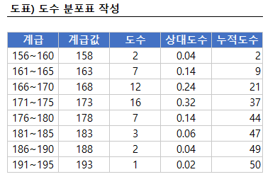
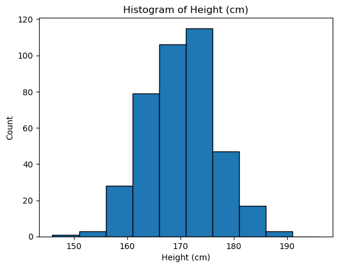
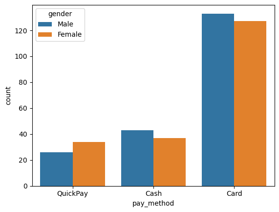
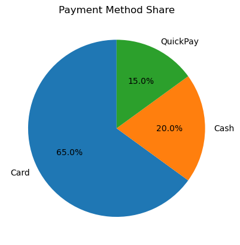
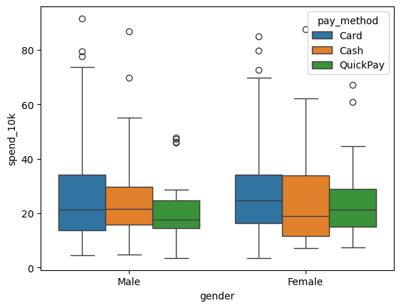
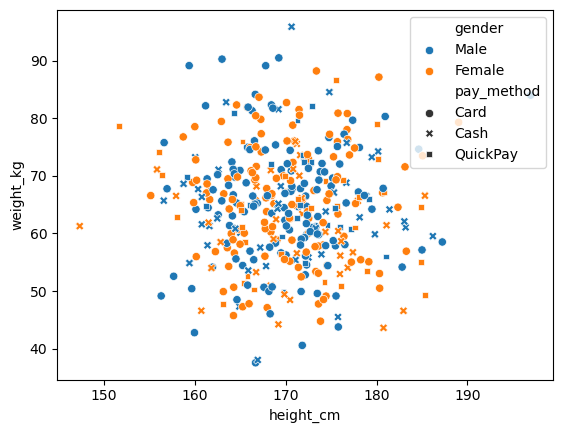
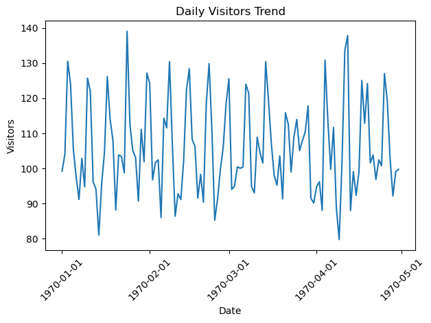
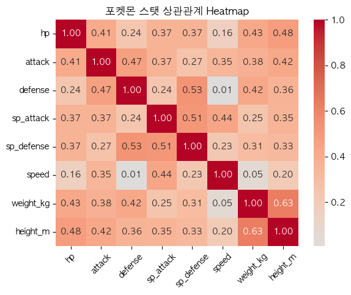

# 📊 기초 통계학 강의 정리 (1회차)

## INDEX

1. [기술통계](#1-기술통계)
2. [추론통계](#2-추론통계)
3. [데이터 분석의 세 가지 목적](#3-데이터-분석의-세-가지-목적)
4. [모집단과 표본](#4-모집단과-표본)
5. [데이터 유형](#5-데이터-유형)
6. [시각화](#6-도수분포표)

</br>

## 0. 통계를 배워야 하는 이유는?
- 데이터를 **요약**하고 **패턴**을 발견할 수 있음
- 데이터 기반의 **의사결정**을 내릴 수 있음

</br>

``` 
예)
- 고객 만족도 설문조사 분석
- 넷플릭스 시청 데이터 기반 알고리즘 추천
- 아마존 상품 추천 시스템
- 머니볼 저평가 선수 발굴
```
  
</br></br>

## 1. 기술통계

: 데이터를 정리/**요약**/해석/표현/설명하는 통계 방법

- 목적: 흐름을 빠르게 이해하고, 빠르게 결정
  
- 데이터에 대한 대략적인 특징을 간단하고 쉽게 설명

- 단 데이터 중 <span style="color:red">예외(이상치)</span> 라는 게 항상 존재할 수 있다.

</br>

```
예)
- 게임 전적 10전 3승 7패
- 배민 평균 별점 4.8
```
</br></br>

## 2. 추론통계

: 표본(일부)으로 모집단(전체)을 **추정**하는 통계 방법

- 목적: 표본을 바탕으로 모집단 특성을 추정

- 전부 조사하지 않아도 전체를 (대략) 알 수 있음
  
- 항상 불확실성 존재 (표본 오류 가능)

</br>

```
예)
- 선거 출구조사
- 시청률
```
</br></br>

## 3. 데이터 분석의 세 가지 목적


### 3-1. 데이터분석 목적 - ① 요약


|방법|산출물|특징|
|---|---|---|
|**숫자**로 요약| `평균`, `중앙값`, `최빈값` | - 평균은 이상치에 민감</br>- 중앙값은 안정적|
|**그림**으로 요약| `bar`(범주형), `hist`(연속형)|- 모양과 패턴 즉시 확인 가능(직관적)|

→ 가능하면 **(평균+중앙값)** or **(평균+최빈값)** 세트로 사용해서 착시 방지

</br>

### 3-2. 데이터분석 목적 - ② 설명
- ~~데이터를 보며 '무슨 일이 일어났는지' 확인하기~~  ( X )
- 데이터를 보며 **'왜 그런 일이 일어났는지' 찾기**  ( O )
- 내부요인 + 외부요인

→  **"왜 일어났는지" 원인 찾기**

</br>

### 3-3. 데이터분석 목적 - ③ 예측
- 패턴을 보고 앞으로 발생될 사건을 추정 
- 단, 확률적으로만 가능. 100% 확실은 없다!
  
→  패턴 기반 미래 추정

</br></br>

## 4. 모집단과 표본
- **모집단**(Population)
  - 내가 알고 싶은 전체 대상

- **표본**(Sample)
  - 모집단에서 추출한 일부 
  - 모집단을 추정하는 도구

- **전수조사**(Census)
  - 모집단을 전부 다 조사 
  - 현실적으로 불가능 ← 비용·시간·접근성 

- **표본조사**(Sample survey)
  - 일부만 뽑아 전체를 추정
  - 표본이 치우침이 없고(무작위), **대표성**을 가져야 함 -> <span style="color:red">**편향된 표본(Bias) 주의!**</span>
  - 표본크기는 너무 작으면 신뢰성이 떨어지고, 너무 크면 비효율적이다.
  - 설계 check List
    - **표본틀(프레임) 정의**
    - **추출방식**: 단순무작위 / 층화 / 군집 / 체계추출
    - **독립성 보장**: 중복 수집 방지
    - **시점/채널 편향**: 특정 조건 쏠림 주의
    - **목표 오차폭과 n 계산**
      - $n \approx (z·\sigma / E)^2$ 

</br>

> **Tip.** 통계에서 표본이 제대로 뽑히면 **정확**, 잘못 뽑히면 **착시**

</br></br>

## 5. 데이터 유형

### 5-1. 양적 데이터 ( = 수치형 데이터, 숫자)(산술 O)
- 이산형(Discrete): 딱 떨어지는 값
  - 세는 것
  - `예) 주사위, 하루 방문 횟수`

- 연속형(Countinuous): 중간값이 무한히 나올 수 있는 값
  - 재는 것
  - histogram, line plot
  - `예) 키, 몸무게, 체류 시간, 결제 금액`
  > **Tip.** 연속형 변수의 경우, 분석 목적(군집화/범주화 vs 회귀/분포 분석)에 따라 **이산형**처럼 다룰 수도 있음.

</br>

### 5-2. 질적 데이터 ( = 범주형 데이터, 문자)(산술 X)
- 범주형(Categorical): 종류로 구분·분류되는 데이터
  - bar plot, pie chart
  - `예) 결제수단, 날씨, 상품 브랜드`

</br>

### 변수 유형 특징
|유형|구분|특징|예시|그래프|
|---|---|---|---|---|
|수치형|이산형|딱 떨어짐, 세어짐|주사위, 방문자수|depend on|
|수치형|연속형|중간값 무한, 계산 가능|키, 몸무게, 나이, 매출액|histogram, box plot|
|범주형|범주형|계산 불가, 종류로 구분·분류|성별, 혈액형, 날씨, 브랜드|bar plot|

</br>

> **Tip.** 데이터에 적합하지 않은 유형의 그래프는 인사이트를 얻는데 방해가 됨

</br></br>

### 변수 유형별 차트

변수: 알고싶은 대상의 특징을 나타내는 값. 수집되는 정보의 속성.

|변수 개수|범주형 데이터|연속형 데이터|포인트|
|---|---|---|:---:|
|**단변량**|bar plot, pie chart|histogram, box plot|분포 / 비율|
|**이변량**|집단 bar plot, mosaic plot|집단 box plot, scatter plot, line plot|관계|
|**다변량**||buble chart, heatmap|추가 시각화

</br>

> **Tip.** 차트 선택 = 변수 개수 + 데이터 유형


</br></br>


## 6. 도수분포표



### 도구분포표 만드는 6단계

Step 1. 최소·최대값 찾기 &nbsp;&nbsp; → &nbsp; 범위 확인

Step 2. 구간(계급) 나누기 &nbsp; → &nbsp;5cm, 10점 등 일정 간격

Step 3. 계급값 정하기 &nbsp;&nbsp;&nbsp;&nbsp;&nbsp;&nbsp;&nbsp;  → &nbsp;  구간의 대표값

Step 4. 도수 세기 &nbsp;&nbsp;&nbsp;&nbsp;&nbsp;&nbsp;&nbsp;&nbsp;&nbsp;&nbsp;&nbsp;&nbsp;&nbsp; → &nbsp;  각 구간의 개수

Step 5. 상대도수 &nbsp;&nbsp;&nbsp;&nbsp;&nbsp;&nbsp;&nbsp;&nbsp;&nbsp;&nbsp;&nbsp;&nbsp;&nbsp;&nbsp; → &nbsp;  구간 비율 (도수 ÷ 전체)

Step 6. 누적도수 &nbsp;&nbsp;&nbsp;&nbsp;&nbsp;&nbsp;&nbsp;&nbsp;&nbsp;&nbsp;&nbsp;&nbsp;&nbsp;&nbsp; → &nbsp;  아래에서 위로 누적된 비율

</br>

### 도수분포포를 histogram으로 변환

- 도수분포표의 각 행 → histogram 막대 1개

</br></br>

## 7. 히스토그램

### histogram

: 숫자 더미(연속형 데이터)의 분포 모양을 보여주는 그림



- 평균 착시를 막고 진짜 분포를 보여줌
- 집중구간, 분포, 극단값여부, 집단수 등...
- 도수분포표보다 직관적, 가독성 good! → "독자 설득에 용이"


</br></br>

## 8. 막대 그래프

: 범주별 빈도/비율을 막대 높이로 표현하는 그래프



  - '평균'은 범주 비교에 무의미
  
  - 카테고리별 크기 차이 및 순위를 한 눈에 확인 가능
  
  - 가장 단순하고 직관적인 시각화 도구

  - `예) 결제수단, 혈액형분포 등`

- <span style="color: red">주의 !</span>
  - 막대 간격은 반드시 떨어져야 함
  - 항목이 너무 많으면 가독성 저하

</br>

### + 히스토그램 vs 바그래프

<center>

| 구분       | 히스토그램                     | 바 그래프                    |
|------------|--------------------------------|------------------------------|
| **x축**        | 숫자 구간 (bin)                | 범주 (카테고리)              |
| **막대 간격** | 붙어 있음                      | 떨어져 있음                  |
| **목적**       | 데이터 **분포** 파악           | 범주 간 **비교**             |

</center>

  </br></br>

## 9. 원 그래프

: 전체를 원으로 보고, 각 항목을 파이 조각으로 표현



- 각 항목이 차지하는 비율을 직관적으로 보여줌

- 상대적 비중과 순위를 파악하기 쉬움

- `예) 시장 점유율 비교, 설문조사 응답 비율`
  
- <span style="color: red">주의 !</span>
  - 항목은 4~5개일 때 효과적
  - 항목이 너무 많으면 가독성 저하
  - 각도 착시에 주의 → 경우에 따라 막대그래프가 더 명확
  


  </br></br>

## 10. 박스플롯

: 연속형 데이터를 **min / Q1 / Q2(mid) / Q3 / max**로 요약



- 평균과 표준편차에서 놓치는 극단값(이상치) 확인
  - IQR(Q3 - Q1): 박스 길이
  - ± (1.5 * IQR) 이상: 이상치
  
- 중앙값, 분산, 이상치 동시 확인 가능
  - 수염이 짧다/길다 → 값의 변동성이 작다/크다

- `예) 집단 간 분포 차이 비교`

- <span style="color: red">주의 !</span>
  - 반드시 연속형 데이터에만 사용
  - 항목이 너무 적으면 왜곡 가능
  

  </br></br>

## 11. 산점도

: 두 변수를 좌표평면 위에 점으로 찍어 **관계**를 보는 그래프



- table로 확인하기 어려운 관계(패턴)을 확인 가능
  - 양의 상관 vs 음의 상관
  - 선형 vs 비선형
- "일반 패턴 + 예외 상황"을 동시 확인 가능

- <span style="color: red">주의 !</span>
  - 상관관계 =/= 인과관계
    - 상관관계: 두 지표가 얼마나 **의존적**인가
    - 인과관계: 하나의 지표로 인해 다른 지표가 변하는 **원인**과 **결과**


  </br></br>

## 12. 선 그래프

:시간을 x축으로 주고 값을 선으로 연결한 그래프



- 시간에 따른 변화(추세)를 연속적으로 보여줌 -> **시계열**

- 트렌드, 주기성(계절성), 이상치(급증/급감) 파악에 용이
  
  - `예) 기간별 매출 추이, 기온 변화, 트래픽 변화 등`

- <span style="color: red">주의 !</span>
  - 시간 간격을 일정하게 유지
  - 단기 변동에 과도한 집착 금지 (노이즈 vs 신호 구분!)
  - 필요시 평균선, 이동평균으로 추세 보강


</br></br>

## 13. 히트맵

: 표 안에 있는 숫자를 색으로 채워 넣은 그래프




- 특정 조합에서 값이 높은지/낮은지 확인

- 숫자/공간/변수의 패턴, 이상치, 집중 구간 파악에 용이

- `예) KPI 항목별 성과 대시보드 등`

- <span style="color: red">주의 !</span>
  - 색상 해석은 반드시 범례 확인
  - 같은 숫자라도 색상 스케일 설정에 따라 다르게 보일 수 있음
  - 데이터 크기에 따라 적절한 색상 팔레트 선택 

