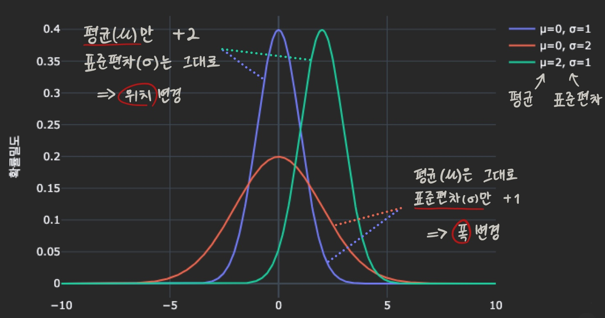

# 📊 기초 통계학 강의 정리 (3회차)

## INDEX

1. [표본공간](#1-표본공간) 
2. [확률](#2-확률)
3. [확률변수와 확률분포](#3-확률변수와-확률분포)
4. [기대값](#4-기대값)
5. [조건부 확률 vs 독립성](#5-조건부-확률-vs-독립성)
6. [정규분포](#6-정규분포)
7. [표준화와 z-score](#7-표준화와-z-점수)
8. [정규 vs 비정규](#8-정규-vs-비정규)
9. [예언구간 vs 신뢰구간](#9-예언구간-vs-신뢰구간)
10. [표본오차](#10-표본오차sampling-error)
11. [표준오차](#11-표준오차se-standard-error)
12. [대수의 법칙과 √n법칙](#12-1-대수의-법칙)
13. [t-분포](#13-t-분포)

  

## 1. 표본공간

### 결과(Sample point)

: 실제로 관측된 딱 하나의 경우

### 사건(Event)

: 그 결과들이 모여있는 집합

### 표본공간(Sample space)
  
: 일어날 수 있는 모든 경우의 전체

- 표본공간은 확률의 첫 단추
- 표본공간을 잘못 정하면 결론이 왜곡됨
- 표본공간을 잘못 정하면 확률, 독립성, 추론까지 전부 틀어짐

  

## 2. 확률

: 사건이 일어날 가능성의 크기를 숫자로 표현한 것

- 단기적으로는 불확실, 장기적으로는 규칙성 드러남
- 확률이 크다고 반드시 일어나는 건 아님
- '진짜 독립인가'를 확인
- 확률 0은 불가능이라기보단, '희박'

 

### + 통계에서 확률을 배우는 이유는?

: 모집단 특성을 '추정'하는데에 100%란 없다. 그렇다면, 확률을 높이자.

- 통계는 불확실한 상황에서 모집단의 특성을 추정하는 학문.
- 확률은 그 불확실성을 수치화해서, ‘**얼마나 신뢰할 수 있는 추정인지**’를 설명.

  -  ~~“한국인 평균 키가 170cm일 확률이 95%다”~~ (**X**)

  - “95% 확률로 한국인 평균 키는 168~172cm 사이에 있다” (**O**)

 

> **Tip.** 어떤 보고가 되던 '수치'로 말하는 것이 직관적

  

## 3. 확률변수와 확률분포

### 3-1. 확률변수(Random variable)

: 사건을 숫자나 값으로 번역하여 수학적으로 다룰 수 있게 표현

### 3-2. 확률분포

: 확률변수가 어떻게 퍼져 있는지 표현

- 이산형 : 막대그래프
- 연속형 : 곡선 + 면적

- 모양을 결정하는 파라미터 존재

    |파라미터|역할|⬆|⬇|
    |---|---|:---:|:---:|
    |**평균 $\mu$**|분포의 중심 위치(대표값)|오른쪽으로|왼쪽으로|
    |**표준편차 $\sigma$** |분포의 흩어짐(안정성)| 넓고 낮아짐| 좁고 높아짐 |

 

> **Tip.** 분석가는 데이터를 그냥 보지 않고, 분포의 모양을 먼저 본다!

  

## 4. 기대값

: 확률적으로 기대되는 평균값 → 많은 시도를 반복했을 때 수렴하는 평균값

- 장기적으로 기대되는 평균 수준
- but, 단기 불확실성은 따로 고려해야함! (분산/표준편차로 보완)

  

## 5. 조건부 확률 vs 독립성

### 5-1. 조건부 확률(Conditional Probability)

: 어떤 사건이 일어난다는 조건 하에서 다른 사건이 발생할 확률

- $P(B|A)$ , $P(A|B)$ : 조건 순서가 달라지면 다른 의미

### 5-2. 독립성(Independence)

: 두 사건이 서로 영향을 주지 않음

 

> **Tip.**
> - 원래 독립이지만 환경 때문에 깨질 수 있음
> - 현실 데이터는 대부분 독립이 아님
> 
> 때문에, 데이터 분석가는 "**정말 독립인가?**"를 항상 의심해야 함

  

## 6. 정규분포 $N(\mu, \sigma)$

: 종 모양의 대칭 분포

- 평균을 중심으로 좌우대칭
- 평균에서 멀어질수록 데이터의 빈도 감소
- 예측(예언 구간) + 추정(신뢰 구간)

 

### 정규분포의 경험규칙 (= 68-95-99 법칙)

- 평균 ± 1σ(1.0) → 약 68%
- 평균 ± 2σ(1.96) → 약 95%
- 평균 ± 3σ(2.58) → 약 99%

    ⇒ 구간이 너무 넓으면 의미가 없고, 너무 좁으면 예측이 어려움

 

### 중심극한정리
: 모집단에서 크기가 n인 표본을 뽑아 평균을 구하는 과정을 반복하여 n이 충분히 커지면, 표본평균들의 분포가 정규분포에 가까워짐

- 필수 조건
  - 표본들이 서로 독립적
  - 모집단의 평균과 분산이 유한
  - 표본 크기가 충분히 큼

 

> **Tip.** 모든 데이터가 정규분포를 따르지는 않음. ⇒ 히스토그램, 박스플롯으로 모양확인 필요!
> 
  

## 7. 표준화와 z-점수

### 7-1. 표준화
: 데이터의 단위와 범위를 맞추기 위해 평균($\mu$)을 0, 표준편차($\sigma$)를 1로 바꾸는 과정

### 7-2. z - score
: 특정값이 평균에서 표준편차 몇 배 떨어졌는지를 보여주는 상대적 척도

  
$$Z = \frac{x - \mu}{\sigma}$$

- 단순 수치보다 직관적으로 상대적 위치 확인 가능
- 단위가 달라도, 분포가 달라도 같은 기준(스케일) 위에서 비교 가능
- 희귀성 비교(어떤 게 더 드물게 나타나나)는 가능하지만, 절대적으로 어떤 게 우월하다는 뜻은 아님

  

## 8. 정규 vs 비정규

### 8-1. 정규 근사

- `키·몸무게` (충분한 표본) -> 정규분포 근사
- `시험 점수` (적절한 난이도) -> 정규분포 근사
- `측정 오차` -> 정규분포 근사

    ⇒ 정규 가정해도 ㄱㅊ

 

### 8-2. 정규 경계

- `소득·매출`: 대부분 소액, 극소수 엄청 높음 -> 오른쪽 long-tail
- `주식 수익률·트래픽`: 폭락·폭등이 자주 발생 -> heavy-tail
- `이탈률, 성공·실패` -> 이항분포

    ⇒ 억지로 정규 가정시,  평균 착시 발생, 부정확한 분산 추정, 잘못된 가설·신뢰구간 도출

 

### + Long-tail vs Heavy-tail

- **Long-tail** : 데이터 불균형
- **Heavy-tail** : 극단치가 자주 등장

  

>**Tip.** 실무
>
>1. 히스토그램 모양 확인 '종 모양인가?'
>2. 박스플롯 확인 '꼬리길이는? 이상치는?'
>3. 정규에 근사하는 경우 &nbsp; → &nbsp; z-score, 신뢰구간, 가설검정 활용
>4. 정규와 다르면 &nbsp; → &nbsp; 로그정규, 포아송, 이항, 파레토 등 대안 분포 고려
>
>       ⇒ **선 - 데이터 모양 확인! &nbsp; 후 - 공식!**

  

## 9. 예언구간 vs 신뢰구간

||대상|폭|표현 예시|
|---|---|---|---|
|**예언구간**|다음 개별 데이터 값|넓음|*다음 사람 키가 150 ~ 180cm 사이일 확률이 95%*
|**신뢰구간**|모집단의 모수(보통 평균)|좁음|*모집단 평균 키가 150 ~ 180cm 사이일 확률이 95%다*

 

### 9-1. 예언구간(PI; Prediction Interval)

: 다음 값 하나를 예측하는 범위

- 가정(정규성, 독립성, 시계열) 위배시 구간 신뢰성 붕괴
1. 평균 μ, 표준편차 σ인 정규분포에서 다음 값 하나 𝑥에 대한 95% 예언구간
- - μ ± 1.96σ → 개별 값은 변동이 커서 **구간이 넓음**

2. 표본평균 $\bar{x}$에 대한 95% 예언구간
-  - μ ± 1.96(σ/$\sqrt{n})$ → 표본평균의 분산이 줄어 구간 폭이 좁아짐

 

### 9-2. 신뢰구간(CI; Confidence Interval)

: 표본으로부터 모수(구하고자하는 통계값)이 포함될 것으로 기대되는 구간

 

1.	우리가 궁금한 건 모집단 평균(μ)
→ 예: 전체 학생들의 평균 키

2.	하지만 전수조사는 무리이기에 일부만 뽑아 표본평균($\bar{x}$)으로 추정
	
3.	문제는, 표본을 뽑을 때마다 평균이 달라짐
	
4.	그래서 모집단 평균(μ)이 있을 법한 범위를 설정 → 이 범위를 **신뢰구간**이라고 함

 

- 평균은 안정적이라 **구간이 좁음**
- 맞는 해석
  - 구간 중 95%가 진짜 μ를 포함한다.
- 틀린 해석
  - 구간이 95% 확률로 μ를 포함한다.
  
 

>**Point.**  μ는 고정값. 신뢰구간은 유동값. &nbsp; ⇒ &nbsp; '확률'은 μ가 아니라 신뢰구간을 설정에 적용

  

## 10. 표본오차(Sampling Error)

: 표본의 통계량과 모집단 모수 간의 실제 차이

- 주로 모집단평균과 표본평균의 차이 
  
- '이번에 뽑은 표본이 실제로 얼마나 빗나갔나'
  
- ~~계산 실수~~ (**X**)
  
- 어쩔 수 없이 생기는 자연스러운 오차 (**O**)

  

## 11. 표준오차(SE; Standard Error)

: 표본 통계량(주로 표본평균)들의 표준편차

- 표본평균이 얼마나 불안정한지 나타내는 값 
  
- '표본을 여러 번 뽑는다면 평균적으로 얼마나 빗나갈까'
  
- 표본($n$)이 많아질수록 분포($\sigma$)의 폭이 좁아지고, 표준오차($SE$)가 작아진다.

$$SE = \frac{\sigma}{\sqrt{n}}$$

  

## 12. 대수의 법칙과 √n 법칙

### 12-1. 대수의 법칙
: 표본($n$)이 많아질수록 표본평균($\bar{x}$)은 모집단평균($\mu$)에 비슷해진다.

### 12-2. $\sqrt{n}$ 법칙
 1.	n을 2배로 늘리면 → 폭은 약 0.71배
 - √2 ≈ 1.41 → 오차는 1/√2 = 0.71배로 줄어듦.
 - 즉, 샘플을 2배로 늘려도 폭은 29% 줄어드는 데 그침.

 2.	폭을 절반으로 줄이려면 → n을 4배로 늘려야 함
 - √4 = 2 → 오차는 1/2로 줄어듦.
 - 즉, 정밀도를 2배 올리려면 표본을 무려 4배나 더 뽑아야 함.

    ⟹ 표본을 늘리면 신뢰구간은 좁아지지만, 효율이 기하급수적으로 떨어짐

  

## 13. t-분포

: 표본이 작을 때(관념적으로 n ≦ 30) 정규분포 대신 사용

- **Case 1) 모집단의 표준편차(σ)를 아는 경우**
  - 신뢰구간 계산 시 정규분포(Z분포) 사용
  - 95% 신뢰수준에서는 약 ±1.96을 기준으로 함

- **Case 2) 모집단의 표준편차(σ)를 모르는 경우**
  - 대신 표본 표준편차(s)를 사용
  - 이때는 t-분포를 사용해야 함
  - **Why?**
    - 실제 분석에서는 σ를 모르는 경우가 대부분 

      → s는 σ보다 정확도가 떨어지기 때문에 불확실성이 더 큼

      → 때문에 정규분포보다 *꼬리가 두꺼운 **t-분포** 사용 

        \* Heavy-tail : 극단값이 나올 가능성을 크게 반영 → 더 넓은 신뢰구간이 필요

- 표본 크기가 커지면 t분포가 정규분포에 수렴(**대수의 법칙**)

  

>

>
>||평균|분산|표준편차|
>|---|:---:|:---:|:---:|
>|**모집단**|$\mu$|$\sigma^2$|$\sigma$|
>|**표본**|$\bar{x}$| $s^2$ |$s$|
>
>

