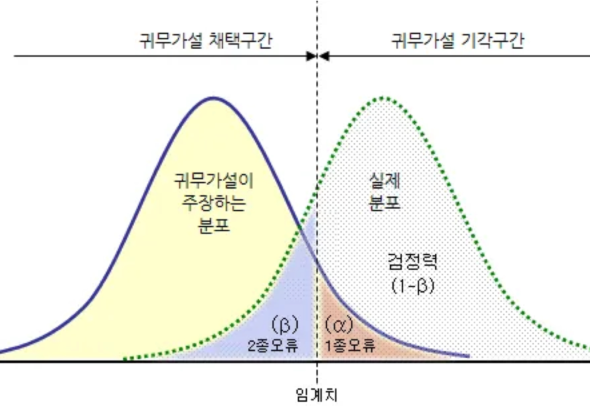

# 📊 통계학 강의 정리 (4회차)

## INDEX

1. [가설검정](#1-가설검정-확증적-분석)
2. [p-value, 유의수준(ɑ), 검정통계량, 양측/단측검정](#2-가설검정의-주요-개념)
3. [t-분포, t-검정](#3-t-검정)
4. [카이제곱분포, 이항분포, 포아송분포, F분포, ANOVA](#4-그-외-분포)
5. [신뢰구간과 가설검정의 관계](#5-신뢰구간과-가설검정의-관계)
6. [가설검정 절차](#6-실무에서의-가설검정-절차)
7. [가설검정의 오류 유형(ɑ, β)](#7-가설검정의-오류-유형)
8. [가설검정 주의점](#8-가설검정-주의점)

 

## 0. 선수지식

- **모집단 vs 표본**
  - 모집단 전수조사 불가능 -> 표본조사
  - 표본평균에는 표본오차가 자연스럽게 생김
- **표본평균의 분포**
  - 같은 모집단에서 뽑아도 평균은 매번 달라짐
  - 흔들림의 크기 = 표준오차(SE)
- **정규분포 VS t-분포**
  - σ 알면 -> "정규분포"
  - σ 모르면 -> 표본$s$ 사용, "t-분포"
  - 표본수↑ : "t-분포"는 "정규분포"에 가까워짐
- **신뢰구간 VS 검정구간**
  - p < 0.05에서 H0 기각 (양측검정)

  

## 1. 가설검정 (확증적 분석)
 : 관찰한 차이가 우연에 의한 것인지를 판단하기 위해 가설을 세워 데이터로 검증

  - 차이가 우연의 산물인지 실제 효과인지 구분하는 절차
  - 데이터가 특정 가설을 지지하는지 평가하는 과정
  - 검정은 표본오차를 전제로 한다. → SE/t-분포/신뢰구간이 따라다님

 

### 1-1. 귀무가설(H₀; Null Hypothesis)
: 내 가설의 부정
- $\mu_A = \mu_B$: "집단$A$와 집단$B$는 차이가 없다"

 

### 1-2. 대립가설(H₁; Alternative Hypothesis)
: 내 가설
- $\mu_A \neq \mu_B$: "집단$A$와 집단$B$는 차이가 있다" → "효과가 있다"

 

### + H₀을 검증(걸러내는?)하는 과정

1. H₀이 기반인 세계를 가정
2. 데이터가 H₀ 세계에서 얼마나 드문지를 확인
3. 너무 드물면 H₀는 맞지 않는다고 보고 기각

 

### + 왜 귀무가설(H₀)부터 확인할까?
Q. 내 가설을 '대립가설'로 두고, 굳이 '귀무가설'을 검증하는 이유는?

- 통계학은 보수적으로 먼저 효과가 없음(H₀)을 전제로 함.
- 부정(귀무가설)을 반박하며 하나씩 제거하는 것이, 내 가설(대립가설)의 타당성/설득력을 올리는 길(반증의 논리)
- 비유 : *무죄 추정의 원칙 = 귀무가설, 유죄 판결 = 대립가설 채택*

 

> **Tip.** 귀류법 : 어떤 명제가 참임을 증명하려 할 때, 그 명제의 결론을 부정함으로써 가정이 모순됨을 보여 간접적으로 그 결론이 성립한다는 것을 증명하는 방법

  

## 2. 가설검정의 주요 개념

### 2-1. p-value

: H₀가 참일 때, 현실에서 관찰된 결과만큼(혹은 그보다 더) 극단적인 결과가 나올 확률

 

### 2-2. 유의수준(ɑ)

: 분석 전에 정해두는 판정 기준선

- 보통 ɑ = 0.05 → "H₀가 참인데도 5%의 확률로 틀릴 수 있다"

 

### 2-3. 검정통계량

: 표본에서 관찰한 값이 귀무가설 아래에서 얼마나 평범한 값인지 보여주는 숫자

 

### + p-value를 통한 유의성 확인
  - **p ≤ ɑ : H₀ 기각**
    - 우연히 일어났을 가능성이 거의 없다 → 유의미(대립가설 지지)
  - **p > ɑ : H₀ 기각 못 함(보류)**
    - 우연히 일어났을 가능성이 높다 (귀무가설 지지 아님)
  
 

> **Tip.**
> 
> - 유의미하다 ≠ 효과가 100% 증명됐다
> 
>   ⟹ "우연으로 보기 어렵다"
> 
> - 유의미하지 않다 ≠ 효과가 없다 
>   
>   ⟹ "판단 보류"

 

### 2-3. 양측검정과 단측검정

- 양측검정(기본값)
  - 좌,우 꼬리를 모두 고료
  - 효과가 너무 작던 너무 크던 잡아내고 싶을 때

- 단측검정
  - 한 쪽 꼬리만 봄
  - 연구에서 남용 경계

  

## 3. t-검정

### 3-1. t-분포
: 모집단 표준편차(σ)를 모를 때, 표본 표준편차(s)로 대신 추정하면서 생기는 불확실성을 반영하는 확률분포.

- 정규분포와 유사하지만, 표본의 크기가 작을수록 꼬리가 두꺼워짐

### 3-2. t-검정
: 차이를 데이터의 변동성에 비춰 상대적으로 평가하는 절차

- 'H₀ vs H₁'를 세워서 계산한 t값이 t-분포에서 얼마나 극단적인지 보고 판단
- t-검정에서 구한 통계량이 t-분포를 따른다
- 전제
  - 정규성: 표본이 정규분포를 따르는 모집단에서 나왔다고 가정
    - 정규성 검정방법: Q-Qplot, 샤피로-윌크 검증, KS 검증, 히스토그램 확인
  - 등분산성: 두 집단의 분산이 같다고 가정
    - 등분산성 검정방법: Levene 검정, F-검정, Bartlett 검정

### + t-검정 흐름
**1. 데이터 준비**
   - 비교할 두 집단의 표본평균, 표본수, 표준편차 확인
  
**2. 차이를 흔들림으로 나누기**
   - 두 집단의 평균 차이를 확인하고, 표준오차(SE)와 비교
  $$t = \frac{차이}{표준오차(SE)} = \frac{\bar{X}-\mu}{\frac{s}{\sqrt{n}}}$$
  
**3. t-분포 위에 올려보기**
   - 귀무가설(H₀)이 맞다면, 해당 t값은 t분포를 따름
   - 계산한 t값이 꼬리 영역에 들어간다면 → "드문 일"

**4. 판정**
   - p ≤ ɑ : H₀ 기각
      - 효과가 있다, 차이가 있다
   - p > ɑ : H₀ 기각 못 함(보류)
      - 차이가 있다고 말할 근거 부족

 

### 그니까 직관적으로 말해보자면...

1.	표본이 많으면(SE↓)
     - 데이터가 안정적이라 작은 차이도 의미 있게 보인다 : t ↑, p ↓
2.	표본이 적으면(SE ↑) 
     - 데이터가 흔들려서 같은 차이도 우연처럼 보인다 : t ↓, p ↑

3.	차이가 크면
     - 당연히 더 눈에 잘 띔 : t ↑ → p ↓
	
4.	차이가 작으면
     - 구분이 힘듦 : t ↓ → p ↑

  

## 4. 그 외 분포

### 4-1. 카이제곱분포((Chi-Square Distribution))

: k개의 서로 독립적인 표준정규 확률변수를 각각 제곱한 다음 합해서 얻어지는 분포

- **독립성 검정**
  - 두 범주형 변수 간의 관계가 있는지 확인
- **적합도 검정**
  - 관측한 값들이 특정 분포에 해당하는지 확인
- 상관/인과관계를 판별하고자 하는 원인의 독립변수가 완벽하게 다른 질적 자료일 때 활용
  - `예) 성별이나 나이에 따른 후보 지지율`

 

### 4-2. 이항분포

: 결과가 두 개(like 성공/실패) 나오는 상황일 때 사용하는 분포

- 연속된 값을 가지지 않고, 특정한 정수 값만 가질 수 있음

 

### 4-3. 포아송분포

: 단위 시간/면적 당 희귀하게 발생하는 사건의 수를 모델링할 때 사용

- 연속된 값을 가지지 않기 때문에 이산형 분포로 분류
- 평균 발생률(λ)이 충분히 크다면 정규분포에 근사
- `예) 콜센터, 교통사고, 문제 메세지, 웹사이트 트래픽`

 

### 4-4. F분포

: 두 개의 카이제곱 분포 확률변수 비율로 정의되는 분포

-  분산의 비교를 통해 얻어진 분포비율
-  각 집단의 모집단분산이 차이가 있는지에 대한 검정과 모집단평균이 차이가 있는지 검정하는 방법으로 사용
-  F = (군간변동)/(군내변동)

> **분산분석(ANOVA)** 
> : 여러 **그룹**의 실험 결과에 유의미한 통계적 차이가 있는지를 검정
>
> - 여러 그룹을 확인하고자할 때, 한 쌍씩 비교하는 횟수가 증가할 수록 우연에 속을 가능성이 증가
> - So, 전체적인 총괄검정(여러 그룹 평균들의 전체 분산에 관한 단일 가설검정) 필요
> - A/B 검정과 비슷한 절차를 확장하여 그룹 간 전체적인 편차가 우연히 발생할 수 있는 범위 내에 있는지를 평가

  

## 5. 신뢰구간과 가설검정의 관계

### 5-1. 신뢰구간
: 표본으로부터 모집단 평균(μ)이 있을 법한 범위를 설정

### 5-2. 가설검정
: 차이가 우연의 산물인지 실제 효과인지 구분하는 절차

 

### 신뢰구간과 가설검정의 관계------68페이지------스킵 모르겠음 열받아 죽겠다 죽여줘 그냥 

- **신뢰구간** 관점 : 차이의 범위를 추정
  - 신뢰구간에서 0이 포함되지 않으면 --> "차이 있다"
- **가설검정** 관점 : 귀무가설(차이 = 0)을 검증
  - p-value : H₀가 참이라고 했을 때, 현재 표본처럼 극단적인 결과가 나올 확률
  - p ≤ ɑ : 귀무가설이 맞다는 가정에서 이런 결과가 나올 가능성이 매우 낮으므로 귀무가설(H₀) 기각

  

## 6. 실무에서의 가설검정 절차

1. 가설 설정
   - 귀무가설() : 효과 없음
   - 대립가설() : 효과 있음
   - 기본은 양측검정. 특별한 이유가 있다면 단측검정.
  
2. 표본 설계
   - 무작위, 대표성, 독립성
  
3. 데이터 요약
   - 평균, 표준편차, n, 이상치 확인
  
4. 가설에 적합한 검정 방법 선택
   - 두 집단 평균 → t-검정
   - 등분산 여부 확인 (등분산 t vs Welch t)
  
5. 결과 제시
   - p-value + 신뢰구간
   - 귀무가설 기각 여부
   - 단순 "유의/비유의"를 넘어 효과 크기 범위까지
  
6. 해석 단계
   - 통계적 유의성 vs 실질적 유의성(효과크기)구분
  
7. 제한점 기록
   - 표본수 부족 / 가정 위배 / 다중검정 / 탐색vs확증 구분 등..

  

## 7. 가설검정의 오류 유형

|   | [판단] H₀ 채택 ⭕️ | [판단] H₀ 기각 ❌ |
|---|:---:|:---:|
| **[실제] H₀ 사실 ⭕️**|올바른 판단 (1-α) |**1종 오류 (α)** |
| **[실제] H₀ 거짓 ❌**|  **2종 오류 (β)** |올바른 판단 (1-β) |

- **1종 오류(α)** (α = 유의수준)
  - 우연에 의한 효과였는데, 사실이라고 잘못 판단하는 경우

- **2종 오류(β)**
  - 실제 효과였는데, 우연에 의한 것이라고 잘못 판단하는 경우

  

## 8. 가설검정 주의점

- **재현 가능성** : 동일한 연구나 실험을 반복했을 때 우연히 결과가 나오는 것이 아니라, 항상 **일관된 결과**가 나오는지 확인

- **p-hacking** : 유의미한 결과를 얻기 위해 다양한 변수를 시도하거나, 데이터를 계속해서 분석하는 등 p-값을 인위적으로 낮추는 행위
→ 즉, 결과를 보며 데이터 개수를 늘려서는 안 됨

- **선택적 보고** : 유의미한 결과만 보고하고, 유의미하지 않은 결과는 보고하지 않는 행위

- 가설검정과 EDA를 이분법적으로 바라보기보단, 상황에 맞게 유연하게 접근