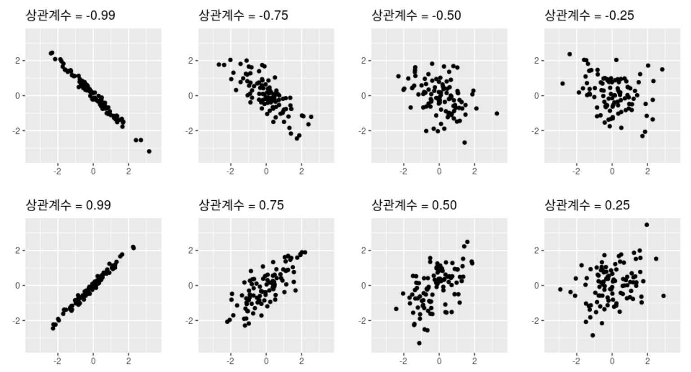
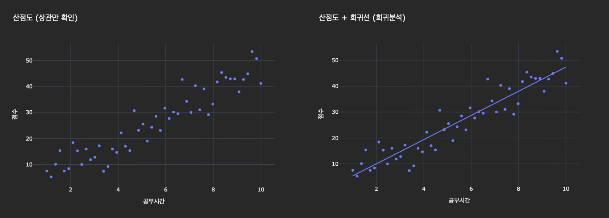

# 📊 통계학 강의 정리 (5회차)

## INDEX

1. [상관, 상관계수, 회귀](#1-상관)
2. [상관관계](#2-상관관계)
3. [피어슨, 스피어만, 켄달의 타우, 상호정보](#3-상관관계와-인과관계)
4. [상관계수와 가설검정](#4-상관계수와-가설검정)

</br>

## 1. 상관

- 데이터로 관계를 확인해야 함 (느낌X)
    
    1. 산점도로 관계를 눈으로 보기
    2. 상관계수(r)을 통해 숫자로 요약하기 

</br>

### 1-1. 양적 변수
- 현실 데이터는 변수가 쌍으로 존재하는 경우 多
- 단일 변수의 평균/분산만 볼 것이 아니라, 관계를 함께 살펴야함
  ```
  예)
    - 학생: 공부시간 ↔︎ 시험점수, "공부시간이 늘수록 점수도 늘까?"
    - 기업: 광고비 ↔︎ 매출, "광고비가 늘수록 매출도 늘까?"
    ```
- **변수 하나씩 보기 → 변수 간 관계 보기**
- 상관계수는 양적 변수끼리만 계산 가능! (범주형에는 적용 불가)

</br>

### 1-2. 산점도
: 두 변수를 동시에 그릴 때 가장 기본적인 도구로, 각 데이터 한 점이 이차원 좌표 위에 찍힘

- 우상향: 양의 상관, 우하향: 음의 상관, 흩어짐: 약한 상관
- 산점도의 중요성
  - **상관계수(r)만** 보고 판단하면 **위험** 존재(상관계수에는 이상치 표시X)
  - 숫자는 왜곡될 수 있지만, 그림은 직관적으로 관계를 보여줌

<center>



</center>


> Tip. 데이터분석가는 항상 **숫자 + 그림**을 함께 제시해야 한다

</br>

### 1-3. 상관계수(r) [-1, 1]
: 산점도의 패턴을 요약해놓은 숫자

- Q. 상관계수 왜 써?
  - 데이터가 커지면 산점도만으로는 해석이 어려움
  - 산점도는 해석자마다 해석이 다를 수 있음

-  이상치가 상관계수에 미치는 영향

   1. 상관계수(r)는 평균과 분산 기반
   2. 평균과 분산은 이상치에 큰 영향을 받음
   3. 따라서, 상관계수(r)는 이상치에 매우 민감

</br>

> **Tip.** 보고 시, 단순히 수치 제시에서 끝내지 말고 **해석**을 제시할 것. (for 비전문가 의뢰인)
> 
> 예)
>
> - Case 1) r = 0.45 (**X**)
>
> - Case 2) r = 0.45로 중간 정도의 상관이 관찰되었으며, 이는 고객 행동 데이터를 다룰 때 의미있는 수준이다. +산점도 이미지 (**O**)

</br>

### 1-4. 회귀(Regression)

- Q. 회귀 왜 써?
  - 상관은 두 변수가 같이 움직인다는 사실만 요약
  - **영향력의 크기**를 알고 싶을 때
    ```
    예)
    - 공부시간을 한 시간 늘리면, 점수는 몇 점 올라갈까?
    - 광고비를 100만원 늘리면, 매출은 얼마나 늘어날까?
    ```

- **상관 vs 회귀**
  - **상관**: 두 변수를 **대칭적**으로 다룸(순서X)
    - `예) 공부시간과 점수가 같이 증가한다.`
  - **회귀**: 설명변수(x)가 변할 때 반응변수(y)가 어떻게 변가는가를 확인(**비대칭적**)
    - `예) 공부시간이 한 시간 증가할 때, 점수가 평균적으로 5점 증가한다.`


  


</br></br>

## 2. 상관관계

### 2-1. 피어슨 상관계수(PCC; Pearson correlation coefficient)
: 두 연속형 변수 간의 선형 관계 강도를 나타내는 계수

$$
PCC = \frac{공분산}{표준편차*표준편차} = \frac{Cov(X, Y)}{\sigma X *\sigma Y}
$$

</br>


- 공분산: 두 변수의 편차를 곱해서 평균낸 값 = 두 변수가 얼마나 같이 움직이는가

  - But, 공분산은 단위가 붙어있는 값. 

  - So, 표준편차(σ)로 나누어 단위를 없애고 -1 ~ +1로 정규화 ⇒ **피어슨**

</br>


- 상관계수에 포함된 내용
  - **방향**
    - $r = + 1$: 완벽한 양의 상관 관계
    - $r = - 1$: 완벽한 음의 상관 관계
    - $r = 0$: 선형관계 없음(곡선관계는 있을 수 있음)

  - **강도**(맥락에 따라 해석이 달라짐)
    - $|r| < 0.3$: 약한 상관 관계
    - $0.3 \leq |r| < 0.7$: 중간 상관 관계  
    - $0.7 \leq |r|$: 강한 상관 관계  

</br>

> **Tip.** 강도의 기준은 **연구 맥락**에 따라 해석이 달라진다.
>
>```
>예)
>- 사회과학, 심리학에서는 0.3 이상이면 유의미
>- 물리학, 공학(노이즈가 적은 분야) 0.95 이상이어야 신뢰
>```

</br>

### 2-2. 스피어만 상관계수(Spearman Rank Correlation Coefficient) (=비모수 상관계수)
: 두 변수의 순위 간의 의존성/일관성을 측정하는 비모수적 척도

- 값이 아니라 순서만 반영하기 때문에, 데이터가 꼭 선형 관계일 필요가 없음.
- 곡선(비선형)관계도 잡아냄

</br>

### 2-3. 켄달의 타우 상관계수(Kendall's Tau Correlation Coefficient)
: 두 변수 간의 순위가 얼마나 일치하는지를 측정하는 비모수적 척도

- 순위 간의 일치 쌍 및 불일치 쌍의 비율을 바탕으로 계산

</br>

### 2-4. 상호정보 상관계수(Mutual Information Correlation Coefficient)
: 두 변수 간의 정보량을 바탕으로 의존성을 측정하는 척도

- 정보량을 계산하기 때문에 범주형 데이터에 대해서도 적용 가능
- 서로의 정보에 대한 불확실성을 줄이는 정도를 바탕으로 계산

</br>

### 2-5. 세 상관계수 비교

||피어슨|스피어만|켄달의 타우|
|---|:---:|:---:|:---:|
|**데이터 유형**|연속형|순위형|순위형|
|**가정**|모수적|비모수적|비모수적|
|**특징**|해석이 쉽고 보편적|이상치・비선형 관계에서 안정적|작은표본, 동점처리에 강함|

</br>

>**Tip.** 모수적 방법 vs 비모수적 방법
>  - 모수적 방법 : 데이터가 특정 분포를 따른다고 가정 </br>
>  -> **피어슨**은 '정규분포', '선형성'과 같은 가정을 깔고 있음
>
>  - 비모수적 방법 : 데이터 분포에 대한 가정을 따로 두지 않음</br>
>  -> **스피어만**은 순위만 있으면 되니까 '정규분포', '이상치'에 구애받지 않음</br>
>  -> 비선형 관계를 탐지하는 **켄달의 타우**도 비모수적 방법

</br></br>

## 3. 상관관계와 인과관계
- 상관관계 ≠ 인과관계
  - 상관관계 : 두 지표가 얼마나 의존적인가?
  - 인과관계 : 하나의 지표로 인해 다른 지표가 변하는 원인과 결과
    - 예시: 아이스크림 판매량↑ - 익사 사고수↑ 원인은 아이스크림이 아니라 여름

</br>

>**Tip.**
>- 상관관계가 있다고해서 원인이라 단정짓지 않는다.
>- 항상 숨어있을 우연&교란 존재 가능성을 의심한다.

</br>

### +. 무작위 통제 실험(RCT; Randomized Control trial)
- 두 집단을 비교할 때 원인만 다르고 그 외 나머지는 똑같아야 함
- 한계: 비용, 윤리적 문제
- 대안: 통계적 인과 추론
  - 데이터를 통해 마치 실험한 것 처럼 분석하는 접근
  - 완벽한 실험은 아니지만, 인과효과(원인→결과)를 최대한 추정할 수 있음
  
- 주요 방법
	1.	**매칭(Matching)**
  - 비슷한 특성을 가진 집단끼리 짝을 지어 비교
  - `예) 나이·성별·소득이 같은 사람을 두 그룹(정책 적용 vs 미적용)으로 나눠 결과 비교`
	
  2.	**자연실험(Natural Experiment)**
  - 세상에서 ‘우연히’ 발생한 사건을 실험처럼 활용
  - `예) 어떤 지역에만 우연히 규제가 먼저 적용된 경우, 그 차이를 활용해 효과 추정`
	
  3.	**차분의 차분(DID; Difference-in-Differences)**
	- 정책 도입 전후 변화를 정책 지역 vs 비정책 지역 간 비교
	- `예) 최저임금 인상 지역 vs 미인상 지역의 고용률 변화를 비교`

</br></br>

## 4. 상관계수와 가설검정

**Step 01. 상관계수 r**
- 데이터로 계산한 표본 상관계수만으로는 모집단에서도 진짜 상관이 있는지 우연인지 확실치 않음 -> **통계적 검정 필요**
  - `예)  r = 0.3 → “표본에서는 X, Y가 약간 양의 상관관계가 있다`

**Step 02. 가설설정**
- 귀무가설(H₀): 모집단에서 상관이 없다 (ρ = 0)
- 대립가설(H₁): 모집단에서 상관이 있다 (ρ ≠ 0) <span style="color: red"><-- 얘가 내 주장</span>

  <span style="color: grey">ρ: 모집단 상관계수</span>

**Step 03. p-value 판정**
- p ≤ 0.05 (H₀ 기각): 우연이라 보기 어렵다 → 유의미한 상관관계
- p > 0.05 (H₀ 기각 못 함): 우연일 수도 있다 → 단정할 수 없음(보류)
  
  <span style="color: grey">p: r을 토대로 검정 통계량을 만들고, 그게 귀무가설(H₀) 하에서 얼마나 우연히 나올 수 있는지를 계산한 값</span>

**Step 04. 신뢰구간 확인**
- 신뢰구간: 모집단 상관계수 ρ가 있을 법한 범위
```
  예)
    - Case 1: r의 95% 신뢰구간이 (0.2 ~ 0.7)
    
      → 0이 포함되지 않음 
      → 상관이 없다는 가설(H₀: ρ=0)은 기각 
      → p ≤ 0.05 (유의미한 상관관계)

    - Case 2: r의 95% 신뢰구간이 (-0.1 ~ 0.6)
  
      → 0이 포함됨 
      → ρ = 0일 가능성을 배제 못 함 (H₀ 기각 못 함)
      → p > 0.05 (단정할 수 없음(보류))
```

</br>

  > **Q.** 여기서 '0'은 무엇?
  > 
  >
  > - 검정에서의 '0' = 귀무가설(H₀: ρ=0, 두 모집단 사이에 차이/상관이 없다.)
  >
  > - 신뢰구간에서 '0' 포함 여부 = 모집단 상관계수 ρ가 0일 가능성이 존재한다
  >
  >   -  표현만 다를 뿐 같은 이야기

